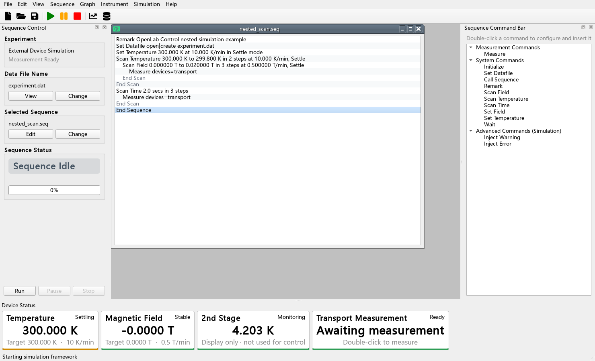
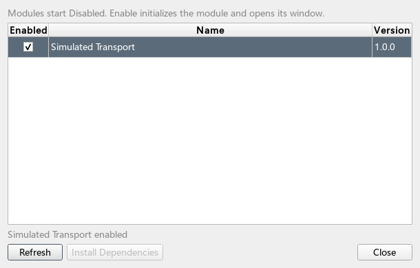
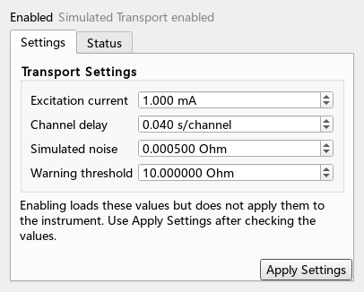
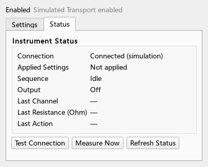

# OpenLab Control

OpenLab Control 是一个以 Quantum Design MultiVu 操作方式为参考、用于外部实验设备的 Python/PySide6 控制框架。它不控制 PPMS 本体；温控仪、磁体电源和只读监视设备由设备插件提供，吉时利组合表、Lakeshore 372 AC Bridge 等完整测量方案由独立的 Measurement Module 提供。

当前版本：`0.10.2`。界面以英文为主，技术与操作文档以中文为主。



## 主要能力

- MultiVu 风格的浮动 SEQ 编辑器、右侧命令列表、双击参数设置、多行选择及 Disable/Enable/Delete/Copy/Paste。
- Wait、Set Temperature、Set Field、Scan Temperature（Linear/List）、Scan Field、Scan Time、Measure、Set Datafile、Remark、Call Sequence，可任意多层嵌套。
- 温度三位小数、磁场原生 Oe 两位小数；目标、速率、上下限和中央数值判稳均由配置控制。
- 温度、磁场与 `2nd Stage` 等 Monitor 实时显示；温场状态块双击后才打开手动控制。
- 独立 Data Browser：拖入任意 DAT 后自动追踪更新；批量选择多个 Y、Overlay/Stacked、共享 X、框选放大、数据点详情、X/Y Log，以及同目录 `.plt` 显示配置。
- Measurement Module 动态发现、显式 Enable、独立 Settings/Status 窗口、后台进程隔离、并行测量和多行流式结果。
- Error 中止 SEQ，Warning 继续；相同活动事件只弹一次，恢复后才允许再次弹出。
- 每次运行保存 SEQ、主配置、模块设置、模块实际状态、实验 DAT 和事件 DAT。

## 最快启动

源码运行：

```text
setup.bat
run.bat
```

已有环境可直接运行：

```text
.venv\Scripts\python.exe run.py
```

无界面验证：

```text
.venv\Scripts\python.exe -m unittest discover -s tests -v
.venv\Scripts\python.exe run.py --headless-demo --sequence examples\module_measurement.seq
.venv\Scripts\python.exe run.py --headless-demo --enable-module simulated_transport --sequence examples\module_measurement.seq
```

第一条无界面运行验证“无模块时 Warning 后继续”；第二条显式启用示例模块，用于验证独立模块进程和多行测量。正常 GUI 启动仍始终从全部 Disabled 开始。

构建 Windows 发布包：

```text
build.bat
```

输出位于 `dist\OpenLabControl\`。发布包旁的 `configs/`、`modules/`、`module_data/`、`module_runtime/`、`wheels/` 和 `runs/` 都会保留为可维护目录。

## 第一次使用测量模块

1. 点击工具栏 `Modules`。
2. 勾选 `Simulated Transport`；初始化成功后才会显示 Enabled，并自动打开模块窗口。
3. 在默认的 `Settings` 页检查参数。Enable 只读取保存值，不会把设置发送给仪表。
4. 如需发送设置，点击 `Apply Settings` 并确认。
5. 在 SEQ 中插入无参数单行 `Measure`，然后点击 `Run`。
6. 每个 Measure 会并行调用所有 Enabled 模块，并等它们全部完成后继续。







## 目录

```text
configs/                 主程序配置
modules/                 可发现的测量模块源码
module_data/<id>/        模块保存设置（不放入源码目录）
module_runtime/           所有模块共享的第三方 Python 依赖
wheels/                   共享离线 wheel
plugin_templates/         设备插件与测量模块模板
examples/                 SEQ/DAT/PLT 示例
runs/                     每次运行的完整记录
docs/                     技术、格式、操作与测试文档
src/labcontrol/           框架源码
tests/                    自动测试
```

## 文档入口

- [操作手册](docs/OPERATIONS.md)
- [SEQ 格式](docs/SEQUENCE_FORMAT.md)
- [DAT 与事件格式](docs/DAT_FORMAT.md)
- [配置参考](docs/CONFIGURATION.md)
- [系统架构](docs/ARCHITECTURE.md)
- [设备插件与测量模块开发工作流](docs/PLUGIN_DEVELOPMENT.md)
- [技术规格](docs/TECHNICAL_SPECIFICATION.md)
- [测试计划](docs/TEST_PLAN.md)
- [验证报告](docs/VERIFICATION_REPORT.md)
- [架构决策](docs/DECISIONS.md)

## 安全边界

默认配置和示例模块全部是数值仿真。接入真实硬件前，必须在驱动层配置通信超时，在主配置中确认温场上下限与最大速率，并按 [测试计划](docs/TEST_PLAN.md) 完成只读、低风险控制、Warning、Error、Stop、Disable 和断电恢复验证。模块只获得温度、磁场及 Monitor 的只读快照，不能通过模块 API 改变温度或磁场。
