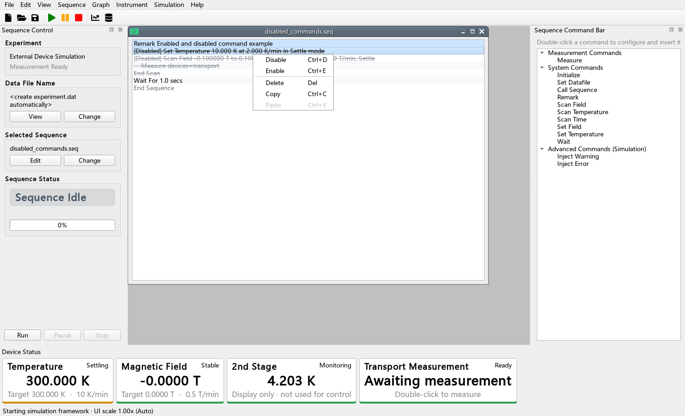
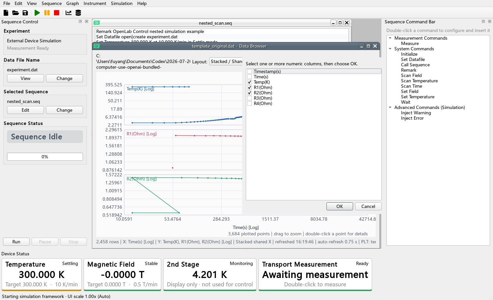

# OpenLab Control

OpenLab Control 是一个面向低温、磁场与输运测量的桌面控制框架。它参考 Quantum Design MultiVu 的操作习惯，但不连接或控制 PPMS；首个版本只加载仿真设备，作为后续温控仪、磁体电源、Keithley、Lake Shore 372 等设备插件的稳定底座。

程序界面以英文为主；操作、技术和插件开发文档保留中文。






## 当前版本包含

- 温度、磁场、测量和只读监视设备的统一插件接口。
- QtAwesome 图标与清晰的浅色桌面界面；关键设备读数保持大字号，SEQ 和命令栏保持紧凑可读。
- 字体与窗口尺寸默认按屏幕原生分辨率自动缩放；4K 使用 1.40×，也可在配置中手动指定。
- 独立只读监视设备；默认 `2nd Stage` 温度只显示和进入 Live Trend，不接受控制、不参与主温度判稳。
- 配置文件控制的上下限、最大速率和数值判稳。
- MultiVu 风格的单行 `.seq` 编辑器，支持多层 Scan 嵌套、Ctrl/Shift 多行选择、批量右键编辑和可持久化的命令禁用。
- Wait、Set Temperature、Set Field、Scan Temperature、Scan Field、Scan Time、Measure、Initialize、Set Datafile、Remark 和 Call Sequence。
- 暂停、继续和中止；默认中止后在当前温度/磁场保持。
- `.dat` 数据文件及独立事件文件。
- 独立浮动 DAT 浏览器：拖入任意文件、自动刷新、一次选择多个 Y、X/Y 独立 Log10、同图多 Y、纵向多图共享 X、框选放大和数据点详情。
- 浏览布局、X/Y 字段和缩放范围自动保存为 DAT 同目录的同名 `.plt`，再次打开时恢复。
- Warning 继续执行、Error 中止执行；同一活动事件只弹窗一次。
- 四个仿真插件和故障注入入口。

## 最快启动

使用 Windows 发布包时，解压整个压缩包，双击 `OpenLabControl.exe`。发布包不要求另装 Python，不能只把 EXE 单独移走（它需要同目录的 `_internal`、`configs` 和 `examples`）。

使用源码目录时，双击 `run.bat`。如果尚未安装依赖，先双击 `setup.bat`。

前端开发时可使用 `run_console.bat` 从控制台启动并保留错误信息，或使用 `open_env.bat` 打开已激活项目虚拟环境的命令行。

也可以在 PowerShell 中运行：

```powershell
python -m venv .venv
.\.venv\Scripts\python.exe -m pip install -r requirements.txt
.\.venv\Scripts\python.exe run.py
```

程序默认加载 `configs/default.toml` 和 `examples/nested_scan.seq`，不会向真实仪表发送命令。运行数据写入 `runs/`。

`examples/template_original.seq` 和 `examples/template_original.dat` 是用户提供模板的逐字节副本，用于兼容性参考；`examples/template_original.plt` 是多图显示示例，`examples/disabled_commands.seq` 演示启用/禁用行。

## 验证

```powershell
.\.venv\Scripts\python.exe -m unittest discover -s tests -v
```

## 文档

- [技术规格](docs/TECHNICAL_SPECIFICATION.md)
- [系统架构](docs/ARCHITECTURE.md)
- [操作手册](docs/OPERATIONS.md)
- [配置参考](docs/CONFIGURATION.md)
- [SEQ 格式](docs/SEQUENCE_FORMAT.md)
- [DAT 格式](docs/DAT_FORMAT.md)
- [设备与插件完整开发工作流](docs/PLUGIN_DEVELOPMENT.md)
- [测试与真实设备上线清单](docs/TEST_PLAN.md)
- [本版本验证报告](docs/VERIFICATION_REPORT.md)

## 安全边界

本项目当前是仿真框架。接入真实温控仪或磁体电源前，必须按测试清单验证硬件联锁、通信中断、超时、中止和恢复行为。本程序不能替代磁体电源、低温系统或实验室的硬件保护。
