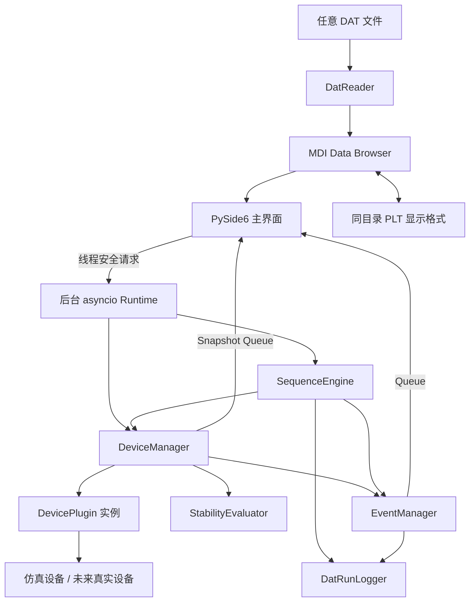
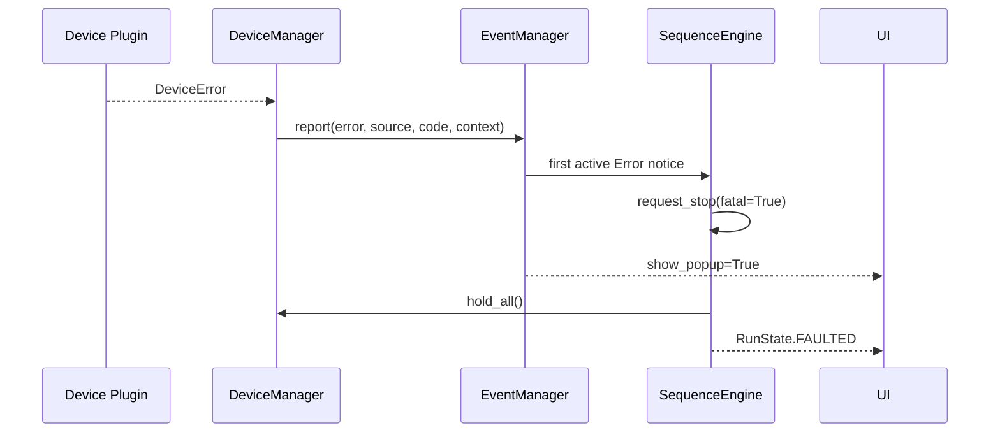

# 系统架构

## 总览



## 目录与职责

| 路径 | 职责 |
|---|---|
| `src/labcontrol/config.py` | TOML 加载、类型化配置、基础校验 |
| `src/labcontrol/models.py` | 状态、事件、运行进度等公共模型 |
| `src/labcontrol/events.py` | Warning/Error 锁存、去重和解除 |
| `src/labcontrol/formatting.py` | 温度/磁场统一精度和负零抑制 |
| `src/labcontrol/stability.py` | 与设备无关的数值判稳 |
| `src/labcontrol/devices/base.py` | 插件公共接口和异常类型 |
| `src/labcontrol/devices/simulated.py` | 温度、磁场、测量和只读 Monitor 四种仿真设备 |
| `src/labcontrol/plugins.py` | 动态加载、设备锁、安全检查和状态汇总 |
| `src/labcontrol/sequence/model.py` | SEQ AST、命令字段定义和编辑操作 |
| `src/labcontrol/sequence/parser.py` | 单行语法解析、兼容读取和序列化 |
| `src/labcontrol/sequence/engine.py` | 嵌套执行、暂停、中止、Scan 和 Measure |
| `src/labcontrol/datafile.py` | DAT、事件、配置快照和 SEQ 快照 |
| `src/labcontrol/dat_reader.py` | 独立 DAT 解码、CSV 规范化和数值点/源行映射 |
| `src/labcontrol/plot_format.py` | `.plt` 版本/尺度校验、旧格式兼容、规范路径、原子保存与加载 |
| `src/labcontrol/runtime.py` | 后台事件循环及 GUI 消息队列 |
| `src/labcontrol/ui/dat_plot.py` | 一次确认式 Y 多选、Linear/Log10、多 Y 绘图、叠加/纵向布局、共享 X、缩放和点命中 |
| `src/labcontrol/ui/data_browser.py` | DAT 浮动窗口、自动刷新、PLT 生命周期和点详情 |
| `src/labcontrol/ui/scaling.py` | 屏幕原生分辨率换算、当前界面倍率与像素缩放工具 |
| `src/labcontrol/ui/` | 主窗口、状态块、弹窗、编辑器和趋势图 |

主界面采用 PySide6 Fusion 样式和小范围自定义 Palette/QSS。QtAwesome 仅负责工具栏矢量图标，不参与设备逻辑；全局正文以 10pt 为缩放基准，设备数值和运行状态通过局部 QSS 放大。未启用独立暗色主题库，以避免无效果依赖和打包体积增加。SEQ 列表重建后显式把水平滚动条归零，保证长命令不会把后续行的命令前缀留在视野外。

左侧文件标签使用水平 `Ignored` 尺寸策略和中间省略绘制：完整字符串只进入 Tooltip，不进入布局最小宽度。这样超长 Windows 路径既可追溯，也不会迫使 QDockWidget 扩张或阻止用户缩回基础宽度。

SEQ 的 `QMdiSubWindow` 使用 `WA_DeleteOnClose = false` 保留文档与编辑器对象。Qt 关闭 MDI 子窗口时会分别隐藏外框及其 child widget，因此 New/Open/Edit 的统一聚焦路径必须同时 `show()` 子窗口和 `SequenceEditorWidget`，再恢复活动窗口；只显示外框会留下灰色空白区域。

`ui.scaling` 以 `availableGeometry × devicePixelRatio` 取得屏幕原生像素尺寸。自动倍率对分辨率比取平方根并限制在 1.00× 到 1.40×，以避免 4K 直接按 2 倍放大；固定控件尺寸、QSS 字号、工具栏图标及绘图边距使用同一倍率。`AppConfig.ui_scale` 为 `None` 时表示 Auto，数值则表示用户手动覆盖。

## 线程模型

应用仅有两个逻辑执行域：

1. Qt 主线程：绘制、编辑 SEQ、显示弹窗和处理用户输入。
2. Runtime 后台线程：拥有一个 asyncio 事件循环，执行全部设备和序列操作。

跨线程通信规则：

- GUI 调用 `RuntimeService`，后者使用 `run_coroutine_threadsafe` 或 `call_soon_threadsafe`。
- Runtime 把 `snapshots`、`event` 和 `progress` 放入线程安全队列。
- GUI 使用 `QTimer` 定期清空队列。
- 插件不得直接访问 Qt，也不得从自己的线程调用 GUI。

Data Browser 是独立分析界面，不经过 Runtime，也不持有设备或当前运行的引用。文件由用户显式选择，Qt 定时器检查修改时间和大小；重新读取失败时保留上一份有效文档并继续重试。因此查看旧数据或第三方 DAT 不会改变当前测量目标、SEQ 或日志路径。DAT 始终只读；界面设置单独写入旁边的 `.plt`。

绘图状态分为共享状态和布局状态：X 列及人工 X 范围由所有曲线共享；Overlay 保存一个公共 Y 范围；Stacked 为每个已选 Y 列保存独立范围。文件刷新只重建数值点，不重置轴、布局或人工视野。切换 DAT 时先建立安全默认轴，再以全量校验方式应用对应 PLT；只要有引用列不存在，就拒绝整份设置，避免混合出意外图形。

X/Y 尺度各自保存为 `linear` 或 `log`。Log10 在数据空间保存范围，在像素映射时执行 `log10`/幂逆变换，因此框选、刻度和点命中仍对应原始数值。零和负值不进入对数范围、不绘制且不命中；绘制路径在每个无效点处断开。切换尺度会清除旧人工范围。PLT 版本 2 持久化尺度，解析器继续接受版本 1 并补齐 Linear 默认值。

## 设备串行化

设备能力由 `DeviceKind` 明确隔离：`temperature` 和 `field` 可控并参与中央判稳，`measurement` 按请求读取通道，`monitor` 只在轮询时产生单个 `current`。因此 `2nd Stage` 不会被 `first_device_id(temperature)`、Set/Scan Temperature、输运仿真的标准温度选择或中止 Hold 路径使用。UI 仍可把 Monitor 快照显示在状态块和 Live Trend 中。

每台设备拥有单独的 `asyncio.Lock`。以下操作共享同一个锁：

- `poll`
- `set_target`
- `hold`
- `measure`

因此不同设备可以并行，同一设备不会在读取过程中同时被设置。真实插件若内部还启动工作线程，必须在插件层再次保证协议会话单写者。

Poll 的稳定性计算与 `latest` 快照发布也在同一设备锁内完成。这样某次 Poll 即使先于 Set Target 开始，也只能在 Set 取得锁之前发布；已完成但仍等待其他设备的批量轮询结果不会在稍后覆盖新目标。

默认 `field` 设备以 Oe 作为框架原生单位。配置限值、速率、中央判稳和插件快照始终在同一原生单位中计算；SEQ 执行入口负责把兼容的 T 命令换算成 Oe。格式化属于边界层：K 温度使用三位小数，Oe 使用两位小数，兼容 T 使用六位小数。参数窗口改变 T/Oe 选择时同时换算目标、Scan 端点和速率，从而保持物理量不变。

Set Datafile 使用逐命令 `path_scope`：普通命令遵循全局外部路径策略，`Custom folder` 序列化为 `external` 并只授权该目标。数据记录器把逐命令授权与配置的 `allow_external_paths` 合并判断，因此 UI 自选目录可用，同时用户提供的旧模板仍默认重定向到本次运行目录。

## SEQ 内部表示

磁盘格式是线性文字，内存格式是抽象语法树：

```text
SequenceDocument
└─ Scan Temperature
   └─ Scan Field
      └─ Measure
```

编辑器把 AST 展平成一行一个显示项，并为容器补充 `End Scan` 行。这样同时满足文本兼容和任意层级执行。

每个命令有稳定的随机 ID 和独立 `enabled` 标志。移动、禁用、删除、双击编辑和插入操作均按 ID 操作，不依赖显示文字。复制使用递归深拷贝，并为整棵子树重新生成 ID；因此粘贴后的 Scan 与原节点互不影响。

编辑器使用 Qt `ExtendedSelection` 保存一组显示行，并按 AST 的先序遍历把它们规范化成命令列表。Scan 开始行和 End Scan 共享 ID，因此天然去重；Copy/Delete 还会剪除已选祖先下的已选后代，使结构性操作只处理最外层节点。剪贴板保存有序命令元组，Paste 逐项插入、逐项重新生成整棵子树 ID，并把所有新顶层节点恢复为选择状态。Disable/Enable 不剪除后代，而是修改每个明确选择节点自己的持久标志。

磁盘行首 `T/F` 映射到 `enabled=True/False`。执行器在发布 STEP_STARTED 或调用设备前检查标志；禁用容器不递归进入子树。FlatRow 同时计算祖先传播后的 `effective_enabled`，只用于界面灰显，不改写子命令自己的持久状态。

`Scan Temperature` 的 AST 以 `point_mode` 区分 `Linear` 与 `List`。Linear 保存起点、终点和点数；List 保存规范化的逗号分隔 K 温度点。参数窗口、文本解析器、格式化器和执行器共用同一个列表解析函数，保证输入校验与运行解释一致。执行器保留点位顺序和重复项，并在第一条设备命令前用 `DeviceManager.validate_target()` 预检全部点和速率，避免后续越界项造成部分 Scan 已经执行。

`CommandDialog` 从主窗口接收本次启动的不可变 `DeviceConfig` 集合，并按命令的 `device_id` 选择同类型设备配置。目标、端点和速率的 Qt 数值控件采用配置范围；字段单位变化时先换算值，再重建换算后的范围。List 无法用单个数值控件表达，因此确认时逐点校验。这里是编辑期反馈层，运行期 `DeviceManager.validate_target()` 仍是独立的安全执行边界。

## Error 传播



重复的同一 Error 只增加内部计数，不再次通知弹窗。恢复时插件或管理器调用 `resolve`。

## 数据一致性

每次运行先创建唯一目录，再写入：

- `sequence.seq`
- `configuration.toml`
- `events.dat`
- 测量 `.dat`

数据行默认写一行刷新一次。序列显示路径和当前温度/磁场快照与测量结果写入同一行，便于追踪每个点的来源。

## 扩展原则

- 新设备：增加 `DevicePlugin` 子类和配置，不修改 SequenceEngine。
- 新命令：在 `CommandType`、`COMMAND_SPECS`、Parser/Formatter 和 Engine 各增加一个封闭分支及测试。
- 新判稳算法：保持 `StabilityEvaluator.update()` 返回结构不变，可替换内部算法。
- 新数据格式：订阅同一事件和测量上下文，不改变设备插件。
- 新 GUI：使用 Runtime 消息协议；控制核心可在无界面模式运行。

## 已知设计限制

- Sweep 当前采用逐点逼近，不提供硬件触发的真正连续扫动。
- Qt 趋势图对每个序列独立缩放，仅用于监视。
- Data Browser 读取在 GUI 线程完成；绘图会抽样到约 12,000 点，但超大文件的首次完整 CSV 解析仍可能造成短暂停顿。
- 插件动态卸载不在首版范围；修改插件后需重启程序。
- 配置只在程序启动时加载，运行中不热重载。
