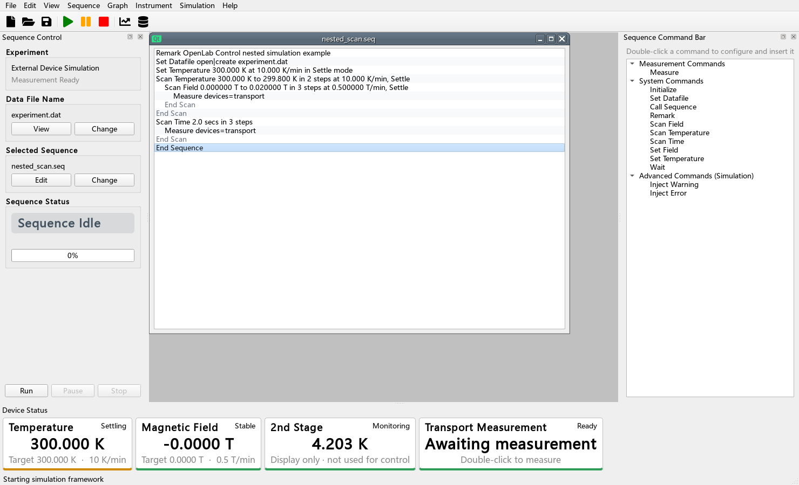

---
hide:
  - navigation
  - toc
---

<section class="olc-hero">
  

    
OpenLab Control 0.14.1 · 中文教程

    <h1>先做出一个能测量的模块，再慢慢增加功能。</h1>
    

      不需要先读懂整个程序。你可以复制一个不连接仪表的四通道例子，运行成功后，再加入
      自己的设置、仪表命令和测量步骤。Enable 后，模块状态和最近通道值会留在主窗口
      左侧；不必一直展开每个独立窗口。
    

    

      <a class="md-button md-button--primary" href="getting-started/">第一次使用</a>
      <a class="md-button" href="development/first-module/">写第一个测量模块</a>
      <a class="md-button" href="development/device-plugin/">更换温度或磁场设备</a>
    

  

  

    <pre><code># 一行生命周期骨架；四通道完整例子见教程
class Module:
    columns = {"Resistance": "Ohm"}
    display_columns = ("Resistance",)

    def open(self, api):
        self.ready = True
        self.output_enabled = False

    def measure(self, channel, api):
        return {"Resistance": 100.0}

    def on_event(self, event, data, api):
        if event == "run_end":
            self.output_enabled = False

    def close(self, api):
        self.output_enabled = False
        self.ready = False</code></pre>
  

</section>

  
<strong>每次收尾</strong>默认关闭，明确选择才保持

  
<strong>4 通道</strong>现成教学例子

  
<strong>70%–150%</strong>文字可独立缩放

  
<strong>无需仪表</strong>先在电脑上练习

## 写测量模块的学习顺序

Measurement Module 是“完成一次测量”的小程序，例如读取电阻、电压或电流。初学时按下面
四步学习即可。

  <a class="olc-card" href="development/first-module/">
    01
    <h3>复制并运行教学模块</h3>
    
先让一个不连接真实仪表的模块出现在列表中，并写出四行测试数据。

  </a>
  <a class="olc-card" href="development/results-and-slots/">
    02
    <h3>让每个通道各写一行</h3>
    
只填写本通道测到的数值；没有测量的列保持空白。

  </a>
  <a class="olc-card" href="development/frontend/">
    03
    <h3>按需增加设置窗口</h3>
    
简单模块可以没有窗口；需要量程、电流等参数时再添加。

  </a>
  <a class="olc-card" href="development/instrument-drivers/">
    04
    <h3>接入真实仪表</h3>
    
每台仪表的命令放在自己的文件里，主文件只写测量顺序。

  </a>

## 温度和磁场设备是另一条路线

温控仪和磁场控制器不属于 Measurement Module。只有需要更换主温度、主磁场或只读监视
设备时，才阅读 [Device Plugin 教程](development/device-plugin.md)。普通测量模块作者可以
完全跳过那一章。一个温控器同时给出样品温度、冷头温度、加热输出等值时，0.14.1 可以
让它们共用一个通讯连接；前面板按普通周期刷新，测量模块需要温场时则会即时读取。同一
设备不会同时执行两次通讯；当前完整指令完成后，测量读取会先于等待中的后台刷新。

## 先记住一条原则

模块只负责自己的仪表和测量步骤。SEQ、DAT 文件、温度目标和磁场目标由主程序管理。这样
开发一个新模块时，不需要理解或修改整个主程序。

  
  
v0.13.0 主窗口；已安装一个示例模块，但仍保持 Disabled。

!!! warning "连接真实仪表前仍要现场检查"

    教学例子只能说明程序怎样运行，不能代替仪表本机的限流、限压、联锁和人工急停。
    没有完成低风险真机检查前，不要无人值守运行。

  <a href="getting-started/">第一次使用：先运行仿真 →</a>
  <a href="development/first-module/">开始写第一个测量模块 →</a>

